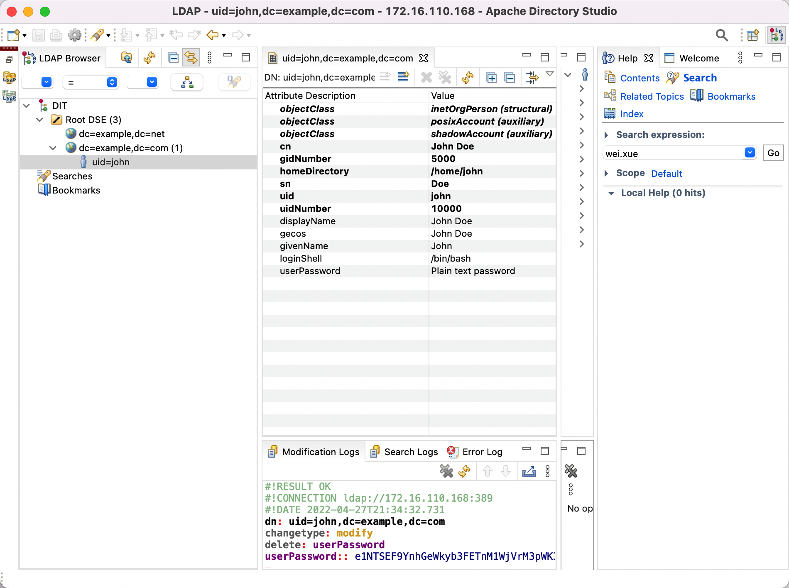

### How to install OpenLDAP 

#### A1 centos7 yum 安装

```
yum install openldap openldap-servers openldap-clients openldap-devel 
```

```
[root@k8s-node1 openldap-servers]# pwd
/usr/share/openldap-servers
[root@k8s-node1 openldap-servers]# tree
.
├── DB_CONFIG.example
└── slapd.ldif


0 directories, 2 files
[root@k8s-node1 openldap-servers]# 
```

#### A2 编译安装：

Openssl 1.1.1n

```
wget https://www.openssl.org/source/openssl-1.1.1n.tar.gz
tar -xf openssl-1.1.1n.tar.gz
./config
make
make install
```
openlap 2.6.1
```
wget https://www.openldap.org/software/download/OpenLDAP/openldap-release/openldap-2.6.1.tgz
Tar -xf openldap-2.6.1.tgz
./configure --with-tls=openssl
make depend
make
make test
make install
```

初始化cn=config

```
# example config file - global configuration entry
dn: cn=config
objectClass: olcGlobal
cn: config
#olcReferral: ldap://root.openldap.org
olcArgsFile: /usr/local/var/run/slapd.args
olcPidFile: /usr/local/var/run/slapd.pid
olcTLSCACertificateFile: /usr/local/etc/openldap/certs/ca.pem
olcTLSCertificateFile: /usr/local/etc/openldap/certs/ldapserver.pem
olcTLSCertificateKeyFile: /usr/local/etc/openldap/certs/ldapserver.key

# internal schema
dn: cn=schema,cn=config
objectClass: olcSchemaConfig
cn: schema

# include the core schema
include: file:///usr/local/etc/openldap/schema/core.ldif

# global database parameters
dn: olcDatabase=frontend,cn=config
objectClass: olcDatabaseConfig
objectClass: olcFrontendConfig
olcDatabase: frontend
#olcAccess: to * by * read

# set a rootpw for the config database so we can bind.
# deny access to everyone else.
dn: olcDatabase=config,cn=config
objectClass: olcDatabaseConfig
olcDatabase: config
#olcRootDN: gidNumber=0+uidNumber=0,cn=peercred,cn=external,cn=auth
olcAccess: {0}to * by dn.base="gidNumber=0+uidNumber=0,cn=peercred,cn=external
 ,cn=auth" manage by * none
#olcRootPW: {SSHA}XKYnrjvGT3wZFQrDD5040US592LxsdLy
#olcAccess: to * by * none

# MDB definition for example.com
dn: olcDatabase=mdb,cn=config
objectClass: olcDatabaseConfig
objectClass: olcMdbConfig
olcDatabase: mdb
olcSuffix: dc=example,dc=com
olcDbDirectory: /usr/local/var/openldap-data
olcRootDN: cn=Manager,dc=example,dc=com
olcRootPW: secret
olcDbIndex: uid pres,eq
olcDbIndex: cn,sn pres,eq,approx,sub
olcDbIndex: objectClass eq
olcAccess: to attrs=userPassword
  by self write
  by anonymous auth
  by dn.base="cn=Admin,dc=example,dc=com" write
  by * none
olcAccess: to *
  by self write
  by dn.base="cn=Admin,dc=example,dc=com" write
  by * read

#MDB definition for example.net
dn: olcDatabase=mdb,cn=config
objectClass: olcDatabaseConfig
objectClass: olcMdbConfig
olcDatabase: mdb
olcSuffix: dc=example,dc=net
olcDbDirectory: /usr/local/var/openldap-data-net
olcRootDN: cn=Manager,dc=example,dc=com
olcDbIndex: objectClass eq
olcAccess: to * by users read
```

添加两个domain

```
dn: dc=example,dc=com
objectClass: top
objectClass: dcObject
objectclass: organization
o: test com
dc: example
```

```
dn: dc=example,dc=net
objectClass: top
objectClass: dcObject
objectclass: organization
o: test com
dc: example
```

生成slapd.d文件    

```
/usr/local/sbin/slapadd -n 0 -F /usr/local/etc/openldap/slapd.d -l /usr/local/etc/openldap/slapd.ldif
```

修改相关文件权限：

启动：

```
slapd -F /usr/local/etc/slapd.d
```

验证：

```
ldapsearch -x -b '' -s base '(objectclass=*)' namingContexts
```

```
ldapsearch -Q -LLL -Y EXTERNAL -H ldapi:/// -b cn=config
```

用systemd管理，编辑启动文件

vim /usr/lib/systemd/system/slapd.service

```
[Unit]
Description=OpenLDAP Server Daemon
After=syslog.target network-online.target
Documentation=man:slapd
Documentation=man:slapd-mdb

[Service]
Type=forking
PIDFile=/usr/local/var/run/slapd.pid
Environment="SLAPD_URLS=ldap:/// ldapi:///" "SLAPD_OPTIONS=-F /usr/local/etc/slapd.d"
ExecStart=/usr/local/libexec/slapd -u ldap -g ldap -h ${SLAPD_URLS} $SLAPD_OPTIONS

[Install]
WantedBy=multi-user.target
```


https://wiki.shileizcc.com/confluence/pages/viewpage.action?pageId=39223494

slapcat 数据导出

-短横线分隔属性，空行分隔条目

OpenSSL加密数据传输


签发CA证书

```
openssl req -x509 -new -nodes \
-subj "/C=CN/ST=ShangHai/L=ShangHai/O=ldap/OU=ca/CN=ldap.host.com/emailAddress=ca@ldap.mail.com" \
-keyout ca.key -sha256 -days 3650 -out ca.pem
```
证书请求文件, CN与主机fqdn保持一致

```
openssl req -new -nodes \
-keyout ldapserver.key -out ldapserver.csr \
-subj "/C=CN/ST=ShangHai/L=ShangHai/O=server/OU=ldap/CN=turing.com/emailAddress=ldapserver@ldap.mail.com"  
```

vim openssl.cnf

```
[default]
#Extensions to add to a certificate request

#basicConstraints = CA:TRUE
#keyUsage = nonRepudiation, digitalSignature, keyEncipherment
subjectAltName=@alt_names

[alt_names]
#DNS.1 = flymote.com
#DNS.2 = *.flymote.com
#DNS.3 = www.flymot.com
#DNS.4 = *.flymot.com
DNS.1 = *.host.com
DNS.2 = turing.com
#IP.1 = 1.2.3.4
#IP.2 = 5.6.7.8
```

签发服务端证书

```
openssl x509 -req -days 3650 -sha256 -extfile openssl.cnf -extensions default \
    -CA ca.pem -CAkey ca.key -CAserial ca.srl -CAcreateserial \
    -in ldapserver.csr -out ldapserver.pem
```

-sha256 是采用sha256离散算法，谷歌浏览器不在支持sha1算法的安全提示，也即是说如果用sha1作为参数，谷歌浏览器可能显示为不安全

The -nodes argument above prevents encryption of the private key. OpenLDAP only works with unencrypted private keys.
The Common Name for this cert should be the fully qualified domain name of the server:

```
openssl verify -CAfile ca.pem ldapserver.pem
```

ldap服务端指定证书位置

Vim cert.ldif

```
dn: cn=config
changetype: modify
replace: olcTLSCACertificateFile
olcTLSCACertificateFile: /usr/local/etc/openldap/certs/ca.pem
-
replace: olcTLSCertificateFile
olcTLSCertificateFile: /usr/local/etc/openldap/certs/ldapserver.pem
-
replace: olcTLSCertificateKeyFile
olcTLSCertificateKeyFile: /usr/local/etc/openldap/certs/ldapserver.ke
```
修改cn=config后端配置

```
ldapmodify -Q -Y EXTERNAL -H ldapi:/// -f cert.ldif
```

客户端 /usr/local/etc/openldap/ldap.conf 添加

```
TLS_CACERT  /usr/local/etc/openldap/cert/ca.pem
```

在/etc/openldap/ldap.conf配置TLS_CACERTDIR /etc/openldap/cacerts，则需要hash

```
cacertdir_rehash /etc/openldap/cacerts/
```

服务端 TLSVerifyClient默认配置nerver，客户端TLS_REQCERT默认是demand

vim /etc/openldap/ldap.conf

```
TLS_REQCERT never
```

验证服务有效性

```
ldapwhoami -H ldapi:/// -x -ZZ
```

```
openssl s_client -connect 127.0.0.1:636 -showcerts -state -CAfile /etc/openldap/ssl/cacert.pem
```

#### A3 Centos7 系统登录认证

```
yum -y install openldap-clients nss-pam-ldapd
```

```
authconfig --enableldap --enableldapauth \
--ldapserver="turing.example.com” \
--ldapbasedn="dc=example,dc=com” \
--enablemkhomedir --update 
```
添加一些schema,使属性更丰富

```
ldapadd -Y external -H ldapi:///   -f /usr/local/etc/openldap/schema/cosine.ldif 
ldapadd -Y external -H ldapi:///   -f /usr/local/etc/openldap/schema/nis.ldif 
ldapadd -Y external -H ldapi:///   -f /usr/local/etc/openldap/schema/inetorgperson.ldif 
```

添加示例用户

```
dn: uid=john,dc=example,dc=com
objectClass: inetOrgPerson
objectClass: posixAccount
objectClass: shadowAccount
uid: john
sn: Doe
givenName: John
cn: John Doe
displayName: John Doe
uidNumber: 10000
gidNumber: 5000
userPassword: johnldap
gecos: John Doe
loginShell: /bin/bash
homeDirectory: /home/john
```

客户端配置完成后，可以用john进行登录

```
[root@k8s-node1 openldap]# getent  passwd john
john:x:10000:5000:John Doe:/home/john:/bin/bash
```


